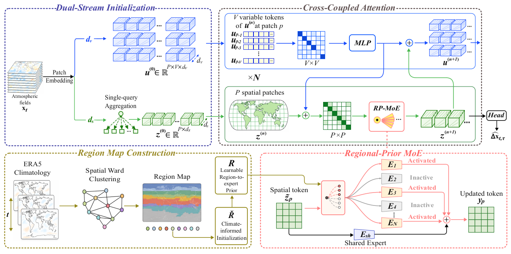
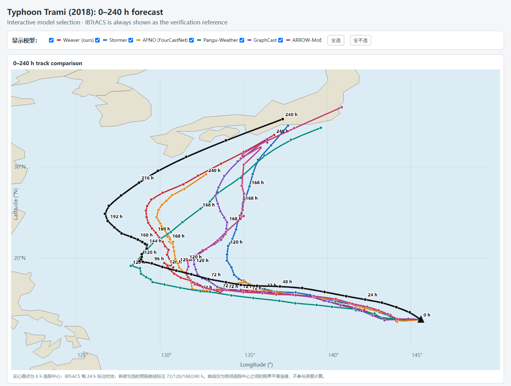

# WEAVER

Official research code for **WEAVER: Global Weather Forecasting with
Cross-Variable Interactions and Region-Guided Expert Routing**.

This repository provides the paper's WEAVER implementation, including training
from random initialization, checkpoint evaluation, single-step diagnostics,
and physical-unit autoregressive prediction.

## Architecture

[](Weaver-overview.pdf)

## What is included

```text
Weaver/
├── configs/weaver.yaml         # paper training configuration
├── train.py                    # Lightning/FSDP training
├── predict.py                  # physical-unit autoregressive forecast
├── infer.py                    # low-level normalized-increment diagnostic
├── evaluate.py                 # paper RMSE/ACC protocol
├── requirements.txt            # runtime, data, and test dependencies
├── weaver/                     # paper-aligned model, data, and preprocessing
├── scripts/                    # data/region preparation utilities
├── jobs/                       # portable Slurm entry points
├── assets/
│   ├── region_maps/            # fixed nine-region RP-MoE prior
│   ├── statistics/             # training-only normalization and climatology
│   └── weaver_overview.png     # README architecture preview
├── checkpoints/                # separately distributed model weights
├── tests/                      # release invariants and rollout tests
├── Weaver-overview.pdf         # architecture figure
├── MODEL_CARD.md
└── CITATION.cff
```

### Paper names and implementation names

The release source tree follows the names used in the paper. The model and its
public configuration are simply named `Weaver`.

| Paper term | Release implementation |
| --- | --- |
| WEAVER | `weaver.models.weaver.Weaver` |
| dual-stream initialization | `weaver.models.patch_embedding.DualStreamPatchEmbedding` |
| CCA | `weaver.models.backbone.CrossCoupledAttentionBlock` (or its gather variant) plus the two bridges |
| variable-to-spatial bridge | `weaver.models.backbone.VariableToSpatialBridge` |
| RP-MoE | `weaver.models.backbone.RegionalPriorMoEBlock` and `weaver.models.rp_moe.SoftRegionalPriorMoE` |
| fixed region map and prior | `assets/region_maps/` and the registered model buffers/parameters |

### Design and compute

WEAVER retains the backbone's single global spatial-attention path. For `L`
spatial tokens, the existing spatial attention has quadratic `O(L^2)`
scaling. Cross-variable interactions operate over the fixed set of 71 fields
at each spatial token, so their additional spatial scaling is linear in `L`;
they do not introduce a second global `O(L^2)` attention operation.

The regional MoE stores a nine-expert capacity bank, but each token executes
one shared expert and only its top-3 routed experts. Thus, per layer, expert
capacity scales with the number of stored experts, whereas active expert
computation scales with the selected experts. Together, these choices avoid
an additional global quadratic attention cost and full-expert execution, which
keeps the added active computation from growing disproportionately. The
released configuration is intended for GPU-based research use.

The model uses a `128 x 256` ERA5 grid, 71 input fields, 2 x 2 patches, 24
blocks, hidden size 1024, 16 spatial heads, a 128-dimensional variable stream,
and nine routed experts with top-3 routing. The exact variable ordering is in
[`configs/weaver.yaml`](configs/weaver.yaml).
Relative region-map, statistics, and climatology paths resolve beside a
custom configuration first, then fall back to the bundled project-root assets.

## Cluster rule

Do not run Python, import PyTorch, load the checkpoint, or perform data/model
computation on a login node. Submit the scripts in `jobs/` with `sbatch`, or
run the documented Python commands only inside an allocated compute node.
Plain file operations and `sbatch` submission are safe on the login node.

## Environment

The paper environment used Python 3.8, PyTorch 2.1.2, torchvision 0.16.2, and
Lightning 2.2.1. Inside a compute allocation:

```bash
python -m venv .venv
source .venv/bin/activate
pip install -r requirements.txt
pip install -e . --no-deps
```

This also installs the `weaver-train`, `weaver-predict`, `weaver-infer`,
and `weaver-evaluate` command aliases; the Slurm examples call the source files
directly so that all paths remain explicit. The single requirements file also
covers data preparation and tests.

xFormers is optional. WEAVER automatically falls back to PyTorch
scaled-dot-product attention when it is absent. For the exact paper stack, a
compatible build can be installed with `pip install xformers==0.0.23.post1`.

## Checkpoint

Download the released model file from
[Hugging Face](https://huggingface.co/Josephardic/Weaver) and place it at:

```text
checkpoints/weaver_weights.ckpt
```

For example:

```bash
mkdir -p checkpoints
wget -O checkpoints/weaver_weights.ckpt \
  https://huggingface.co/Josephardic/Weaver/resolve/main/weaver_weights.ckpt
```

This checkpoint is used for prediction and evaluation and is excluded from
ordinary Git commits.

## Dataset

The paper uses 6-hourly ERA5 at 1.40625 degree resolution:

| split | years |
|---|---:|
| train | 2008--2016 |
| validation | 2017 |
| test | 2018 |

The HDF5 layout consumed by training and evaluation is:

```text
/path/to/h5/
├── train/{year}_{index:04d}.h5
├── val/{year}_{index:04d}.h5
└── test/{year}_{index:04d}.h5
```

Each file contains an `input` group with the 71 named `(128, 256)` fields.
Normalization, latitude/longitude, climatology, and region-prior artifacts are
provided under `assets/`. They were derived only from 2008--2016.

### Rebuilding data and priors

The preparation order is download, conservative regridding, HDF5 conversion,
statistics, climatology, and regional prior. All steps run on a compute node:

```bash
# SOURCE may be a complete Zarr URI or a dataset name below
# gs://weatherbench2/datasets/era5/.
sbatch --export=ALL,STEP=download,SOURCE=1959-2023_01_10-6h-240x121_equiangular_with_poles_conservative.zarr,RAW_DIR=/data/era5_raw jobs/preprocess.slurm

sbatch --export=ALL,STEP=regrid,RAW_DIR=/data/era5_raw,REGRID_DIR=/data/era5_128x256 jobs/preprocess.slurm

for split in train val test; do
  sbatch --export=ALL,STEP=h5,SPLIT=$split,REGRID_DIR=/data/era5_128x256,DATA_ROOT=/data/weaver_h5 jobs/preprocess.slurm
done

sbatch --export=ALL,STEP=stats,REGRID_DIR=/data/era5_128x256 jobs/preprocess.slurm
sbatch --export=ALL,STEP=clim,DATA_ROOT=/data/weaver_h5 jobs/preprocess.slurm
sbatch --export=ALL,STEP=regions jobs/preprocess.slurm
```

Submit dependent stages only after the preceding jobs finish successfully (or
use `sbatch --dependency=afterok:<jobid>`). Generated maps must have shapes
`(8192,)` and `(9, 9)`.

## Training from scratch

The configuration matches the paper: AdamW (`beta1=0.9`, `beta2=0.95`, weight
decay `1e-5`), batch size 2 per GPU on 16 H100 GPUs, linear warmup for 10
epochs to `1.25e-4`, cosine decay, at most 150 epochs, and selection by the
lowest 24-hour validation weighted MSE.

```bash
sbatch --export=ALL,DATA_ROOT=/data/weaver_h5,OUTPUT_ROOT=$PWD/outputs/run1 jobs/train.slurm
```

Before a long run, validate the training/data path with one GPU and one batch:

```bash
sbatch --export=ALL,DATA_ROOT=/data/weaver_h5 jobs/train_smoke.slurm
```

Training defaults to random initialization and never deletes existing output.
It does not load the released inference checkpoint. Resume is explicit:

```bash
sbatch --export=ALL,DATA_ROOT=/data/weaver_h5,OUTPUT_ROOT=$PWD/outputs/run1,RESUME=auto jobs/train.slurm
```

`RESUME=auto` requires `OUTPUT_ROOT/checkpoints/last.ckpt`; `RESUME` may
instead be a complete training-checkpoint path.

After selecting the checkpoint with the lowest validation metric, create a
separate inference artifact without overwriting the resumable checkpoint:

```bash
sbatch --export=ALL,INPUT=$PWD/outputs/run1/checkpoints/epoch_XXX.ckpt,OUTPUT=$PWD/checkpoints/my_weights.ckpt jobs/export_weights.slurm
```

## Physical-unit forecasting

`predict.py` accepts one physical ERA5 state with shape `(71,128,256)` or a
batch `(B,71,128,256)`. For every base interval in 6/12/24 hours that divides
the requested horizon, it autoregressively converts predicted increments to
physical units, updates the state, renormalizes it, and averages forecasts in
physical space as described in the paper.

```bash
sbatch --export=ALL,INPUT=/data/input.npy,OUTPUT=$PWD/predictions/t120.npy,LEAD_TIME=120 jobs/predict.slurm
```

The output is an absolute physical-unit state in the same variable order and
shape. A JSON sidecar records the horizon, participating base intervals,
checkpoint, shape, and variables. To export an input from the project HDF5
format, use `scripts/export_h5_input.py` inside a compute job.

`infer.py` provides architecture and checkpoint diagnostics using normalized
tensors. It produces one predicted increment; use `predict.py` for complete
physical-unit forecasts.

The released checkpoint already uses the current module names and requires no
key migration.

## Paper evaluation

Evaluation performs the same autoregressive 6/12/24-hour ensemble and reports
latitude-weighted RMSE and ACC relative to bundled training climatology:

```bash
sbatch --export="ALL,DATA_ROOT=/data/weaver_h5,OUTPUT=$PWD/outputs/test_metrics.json,LEAD_TIMES=24 72 120 240" jobs/evaluate.slurm
```

Checkpoint loading is strict: missing or unexpected parameters terminate the
run rather than silently producing invalid metrics. Use `--resume-from` when
invoking `evaluate.py` directly inside an allocation to continue an evaluation.

## Typhoon track case study

As a qualitative test of long-range tropical-cyclone tracking, six storms were
randomly selected from the 2018 test set where complete model forecasts could
be paired with IBTrACS best tracks. Storm centers were extracted with the same
tracking rule for every model, following the Pangu-Weather procedure: search
for a local sea-level-pressure minimum near the previous center, then screen
the candidate using 850 hPa vorticity, 200--850 hPa thickness, and 10 m wind.

Trami is shown as a representative case. After 72 h, several forecast tracks
develop larger deviations or terminate early, while Weaver preserves a
plausible movement pattern and remains trackable through 240 h. This example
suggests useful long-lead track continuity, but it is a case study rather than
a claim of uniformly lowest position error across storms or lead times.



*Typhoon Trami (2018), initialized from the same ERA5 state for all models.
IBTrACS is the verification track; markers are shown every 6 h.*

## Release validation

The validation job checks configuration/assets, the SDPA fallback, physical
rollout semantics, strict checkpoint loading, and a real 6-hour forecast from
the first test sample:

```bash
sbatch --export=ALL,DATA_ROOT=/data/weaver_h5 jobs/validate.slurm
```

Successful artifacts are written to `outputs/release_validation/`. Shell
entry points can be checked without Python using `bash -n jobs/*.slurm`.

## Citation

Citation metadata is provided in [`CITATION.cff`](CITATION.cff).

The model is for research and reproducibility, not operational weather
warnings. See [`MODEL_CARD.md`](MODEL_CARD.md) for assumptions and limitations.

## License

The code is released under the [MIT License](LICENSE).
